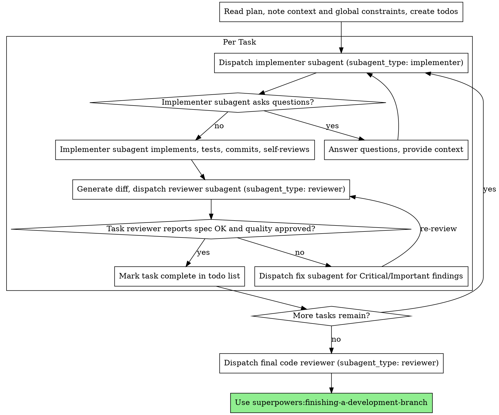

# Subagent-Driven Development

Execute plan by dispatching a fresh implementer subagent per task, a task review (spec compliance + code quality) after each, and a broad whole-branch review at the end.

**Why subagents:** You delegate tasks to specialized agents with isolated context. By precisely crafting their instructions and context, you ensure they stay focused and succeed at their task. They should never inherit your session's context or history — you construct exactly what they need. This also preserves your own context for coordination work.

**Core principle:** Fresh subagent per task + task review (spec + quality) + broad final review = high quality, fast iteration

**Narration:** between tool calls, narrate at most one short line — the ledger and the tool results carry the record.

**Continuous execution:** Do not pause to check in with you between tasks. Execute all tasks from the plan without stopping. The only reasons to stop are: BLOCKED status you cannot resolve, ambiguity that genuinely prevents progress, or all tasks complete.

## The Process



## Pre-Flight Plan Review

Before dispatching Task 1, scan the plan once for conflicts:

- tasks that contradict each other or the plan's Global Constraints
- anything the plan explicitly mandates that the review rubric treats as a defect

Present everything you find to you as one batched question before execution begins. If the scan is clean, proceed without comment.

## Model Selection

Use the least powerful model that can handle each role to conserve cost and increase speed.

**Mechanical implementation tasks** (isolated functions, clear specs, 1-2 files): use a fast, cheap model. Most implementation tasks are mechanical when the plan is well-specified.

**Integration and judgment tasks** (multi-file coordination, pattern matching, debugging): use a standard model.

**Architecture and design tasks**: use the most capable available model. The final whole-branch review is one of these.

**Review tasks**: choose the model scaled to the diff's size, complexity, and risk.

**Always specify the model explicitly when dispatching a subagent.** An omitted model inherits your session's model — often the most capable and expensive.

## Handling Implementer Status

Implementer subagents report one of four statuses. Handle each appropriately:

**DONE:** Generate the diff (`git diff -U10 BASE..HEAD`), then dispatch the task reviewer with the diff.

**DONE_WITH_CONCERNS:** The implementer completed the work but flagged doubts. Read the concerns before proceeding. If the concerns are about correctness or scope, address them before review. If they're observations (e.g., "this file is getting large"), note them and proceed to review.

**NEEDS_CONTEXT:** The implementer needs information that wasn't provided. Provide the missing context and re-dispatch.

**BLOCKED:** The implementer cannot complete the task. Assess the blocker:
1. If it's a context problem, provide more context and re-dispatch with the same model
2. If the task requires more reasoning, re-dispatch with a more capable model
3. If the task is too large, break it into smaller pieces
4. If the plan itself is wrong, escalate to the human

**Never** ignore an escalation or force the same model to retry without changes.

## Constructing Reviewer Prompts

Per-task reviews are task-scoped gates. The broad review happens once, at the final whole-branch review. When you fill a reviewer template:

- Do not add open-ended directives without a concrete, task-specific reason
- Do not ask a reviewer to re-run tests the implementer already ran on the same code
- Do not pre-judge findings for the reviewer — never instruct a reviewer to ignore or not flag a specific issue
- Hand the reviewer the diff: `git diff -U10 BASE..HEAD` for the range
- A dispatch prompt describes one task, not the session's history. A fresh subagent needs its task, the interfaces it touches, and the global constraints. Nothing else.
- Dispatch fix subagents for Critical and Important findings. Record Minor findings as you go.
- If the final whole-branch review returns findings, dispatch ONE fix subagent with the complete findings list.

## Subagents

Dispatch subagents using the `Agent` tool with these `subagent_type` values:

| Agent | subagent_type | When | Model |
|-------|---------------|------|-------|
| **implementer** | `implementer` | Per task — implements, tests, commits, self-reviews | Varies by task complexity |
| **reviewer** | `reviewer` | After each implementer — reviews diff for spec + quality | Scaled to diff size/complexity |

**Dispatching:** Use `Agent` tool with `subagent_type` set to the agent name above. Always specify the model explicitly.

For fix dispatches (Critical/Important findings): re-dispatch the `implementer` with the reviewer's findings.

**Final whole-branch review:** Use `Agent` tool with `subagent_type: "reviewer"`. Pass the diff and global constraints — the reviewer agent's built-in instructions define the review format. For ad-hoc reviews outside SDD, use the `code-reviewer.md` prompt template from `superpowers:requesting-code-review`.

## Example Workflow

```
You: I'm using Subagent-Driven Development to execute this plan.

[Read plan file once: <project>/plans/feature-plan.md]
[Create todos for all tasks]

Task 1: Hook installation script

[Dispatch implementer with task text + context]

Implementer: "Before I begin - should the hook be installed at user or system level?"

You: "User level (~/.config/superpowers/hooks/)"

Implementer: "Got it. Implementing now..."
[Later] Implementer:
  - Implemented install-hook command
  - Added tests, 5/5 passing
  - Self-review: Found I missed --force flag, added it
  - Committed

[Generate diff, dispatch task reviewer]
Task reviewer: Spec OK - all requirements met, nothing extra.
  Strengths: Good test coverage, clean. Issues: None. Task quality: Approved.

[Mark Task 1 complete]

Task 2: Recovery modes

[Dispatch implementer with task text + context]

Implementer: [No questions, proceeds]
Implementer:
  - Added verify/repair modes
  - 8/8 tests passing
  - Self-review: All good
  - Committed

[Generate diff, dispatch task reviewer]
Task reviewer: Spec FAILED:
  - Missing: Progress reporting (spec says "report every 100 items")
  - Extra: Added --json flag (not requested)
  Issues (Important): Magic number (100)

[Dispatch fix subagent with all findings]
Fixer: Removed --json flag, added progress reporting, extracted PROGRESS_INTERVAL constant

[Task reviewer reviews again]
Task reviewer: Spec OK. Task quality: Approved.

[Mark Task 2 complete]

...

[After all tasks]
[Dispatch final code-reviewer]
Final reviewer: All requirements met, ready to merge

Done!
```

## Advantages

**Efficiency gains:**
- Subagent gets complete information upfront
- Questions surfaced before work begins (not after)
- Fresh context per task (no confusion)

**Quality gates:**
- Self-review catches issues before handoff
- Task review carries two verdicts: spec compliance and code quality
- Review loops ensure fixes actually work

**Cost:**
- More subagent invocations (implementer + reviewer per task)
- But catches issues early (cheaper than debugging later)

## Red Flags

**Never:**
- Start implementation on main/master branch without explicit user consent
- Skip task review, or accept a report missing either verdict (spec compliance AND task quality are both required)
- Proceed with unfixed issues
- Dispatch multiple implementation subagents in parallel (conflicts)
- Make a subagent read the whole plan file (hand it its task text instead)
- Skip scene-setting context (subagent needs to understand where task fits)
- Ignore subagent questions (answer before letting them proceed)
- Accept "close enough" on spec compliance (reviewer found spec issues = not done)
- Skip review loops (reviewer found issues = implementer fixes = review again)
- Let implementer self-review replace actual review (both are needed)
- Tell a reviewer what not to flag, or pre-rate a finding's severity in the dispatch prompt
- Move to next task while the review has open Critical/Important issues

**If subagent asks questions:**
- Answer clearly and completely
- Provide additional context if needed
- Don't rush them into implementation

**If reviewer finds issues:**
- Implementer fixes them
- Reviewer reviews again
- Repeat until approved
- Don't skip the re-review

**If subagent fails task:**
- Dispatch fix subagent with specific instructions
- Don't try to fix manually (context pollution)

## Integration

**Required workflow skills:**
- **superpowers:writing-plans** - Creates the plan this skill executes
- **superpowers:requesting-code-review** - Code review template for the final whole-branch review
- **superpowers:finishing-a-development-branch** - Complete development after all tasks

**Subagents should use:**
- **superpowers:test-driven-development** - Subagents follow TDD for each task
